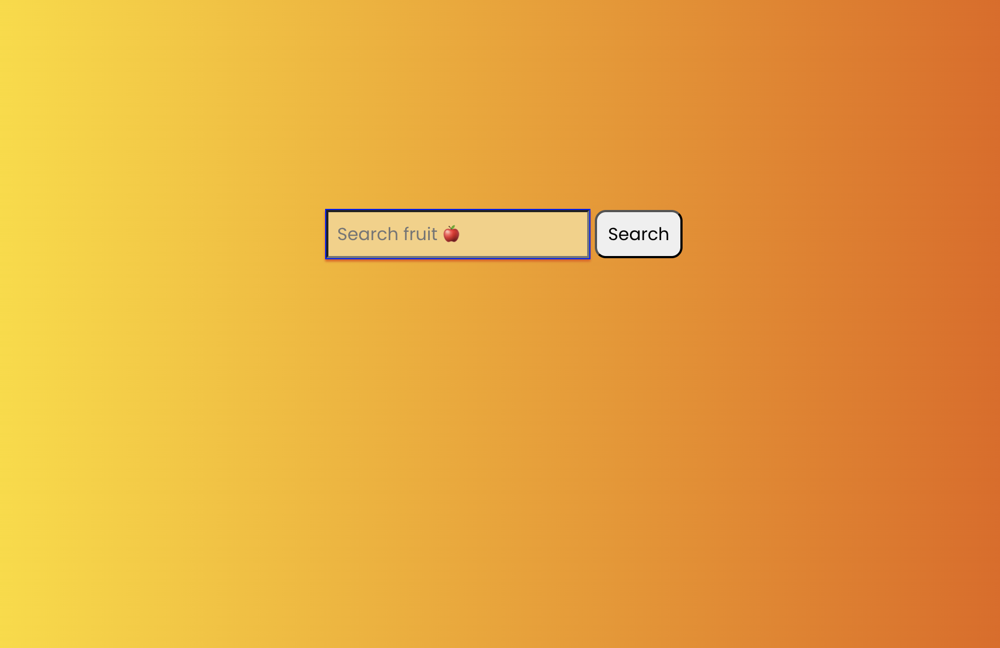

# bc12_FruitSearch
This is a solution to the Fruit Search Challenge. 

## Table of contents

- [Overview](#overview)
  - [The challenge](#the-challenge)
  - [Screenshot](#screenshot)
  - [Links](#links)
- [My process](#my-process)
  - [Built with](#built-with)
  - [What I learned](#what-i-learned)
  - [Continued development](#continued-development)
  - [Useful resources](#useful-resources)
- [Author](#author)

## Overview

### The challenge

Users should be able to:

- use the search bar to search a list of fruit by entering some letters
- click on an item in the list and have it populate the search text input

### Screenshot




### Links

- Solution URL: https://github.com/TechEdDan2/bc12_FruitSearch
- Live Site URL: https://techeddan2.github.io/bc12_FruitSearch/

## My process

### Built with

- CSS custom properties
- Flexbox
- DOM 
- Javacript

### What I learned

The UI layout was basic. The real challenge was using the DOM and the skills gained in the course from the ES2015 section. I incorporated some arrow function syntax (but it could be cleaner), map, spread operator, and various array functions.   

Code snippets:

```css
    /* No major CSS used in the project */
```
```js
/**
	 * MakeBolderLetters highlights the search text in the returned items
	 * @param {String} word - returned word from the search 
	 * @param {number} startIndex - location of the matching text
	 * @param {number} strLength - length of the text typed in seach
	 * @returns {Sting} 
	 */
	const makeBoldLetters = (word, startIndex, strLength) => {
		let boldLtrWrd = "";
		let wordArray = [...word];
		let endIndex = (startIndex + strLength) + 1;

		wordArray.splice(startIndex, 0, "<span>");
		wordArray.splice(endIndex, 0, "</span>");

		boldLtrWrd = wordArray.join("");

		return boldLtrWrd;
	}
```

### Continued development

So as with most of my challenges, I am always unsure of best practices. This is part of the reason I am completing the Bootcamp. I would like to incorporate Jasmine testing into the project, and possibly refactor the code after some feedback to improve it. I wasn't completely happy with my makeBoldLetters solution, so I am curious about alternative solutions. 

### Useful resources

- [MDN](https://developer.mozilla.org/en-US/docs/Web/API/Document_Object_Model) - This helped me when using the Document Object Model to create this project. 
- [Udemy](https://www.udemy.com/course/the-web-developer-bootcamp) - This Udemy course has helped to learn how to use the DOM. I'd recommend it to anyone still learning this concept.
- [Springboard](https://www.springboard.com/) - This is the Bootcamp where I am currently gaining a deeper understanding for JavaScript.  

## Author

- Frontend Mentor - [@TechEdDan2](https://www.frontendmentor.io/profile/TechEdDan2)
- Twitter - [@TechEdDan](https://twitter.com/TechEdDan)
